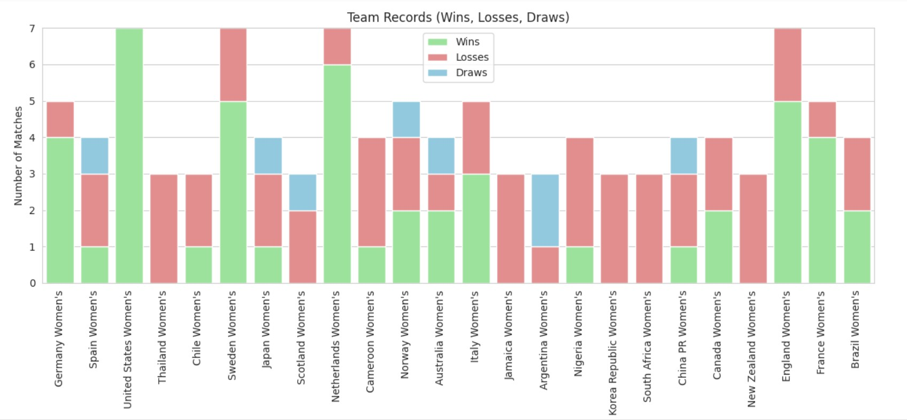
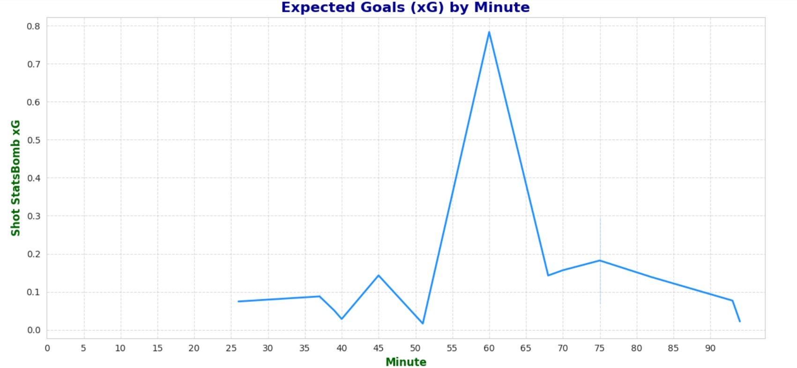
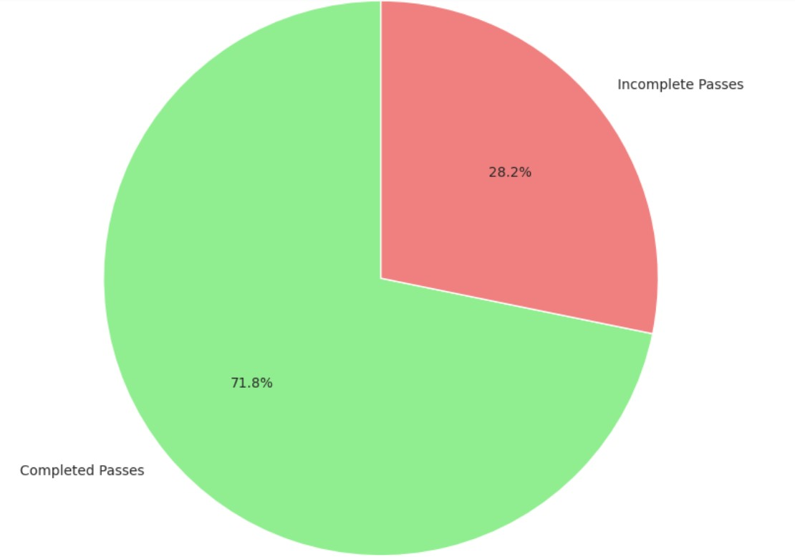

# ⚽ Women's World Cup Data Exploration 

## Project Overview

This project focuses on analyzing the **2019 FIFA Women's World Cup**, specifically the final match between the **United States** and the **Netherlands**. The goal is to explore team and player performances through data visualizations and initial insights using data sourced from the [**StatsBomb API**](https://statsbomb.com/).

## Objectives

- Aggregate and preprocess match and player data from StatsBomb API  
- Visualize key statistics such as wins, losses, goal differences, and shot maps  
- Analyze player performances with shot distribution and pass completion visuals  
- Set the foundation for further machine learning modeling  

## Key Features

- **Competition-level visualizations:** Number of wins, draws, and losses per team; goal difference charts
  
- **Match-level analysis:** Shot maps with xG and shot technique, shot body part distribution, xG over time
  
- **Player performance:** Histograms of shot xG values, pass completion rates, and pass networks  
  Clean charts created using Matplotlib, Seaborn, and Plotly
  

## Data Source

- Data collected via the **StatsBomb API**, providing rich event data from the 2019 Women’s World Cup  

## Libraries Used

- `pandas` , `numpy` for data manipulation  
- `matplotlib`, `seaborn`, and `plotly` for visualization  
- `requests` and `json` for API data retrieval  

## How to Use

1. Open the provided Google Colab notebook  
2. Run cells sequentially to load, preprocess, and visualize the data  
3. Interact with the plots to gain insights on teams and players  

## Next Steps

This exploratory analysis sets the stage for building an interactive dashboard and integrating machine learning model to predict Expected Goals (xG) and deeper football analytics.

👩‍💻 Developed by Nada Ammar — merging passion for football and data science.
